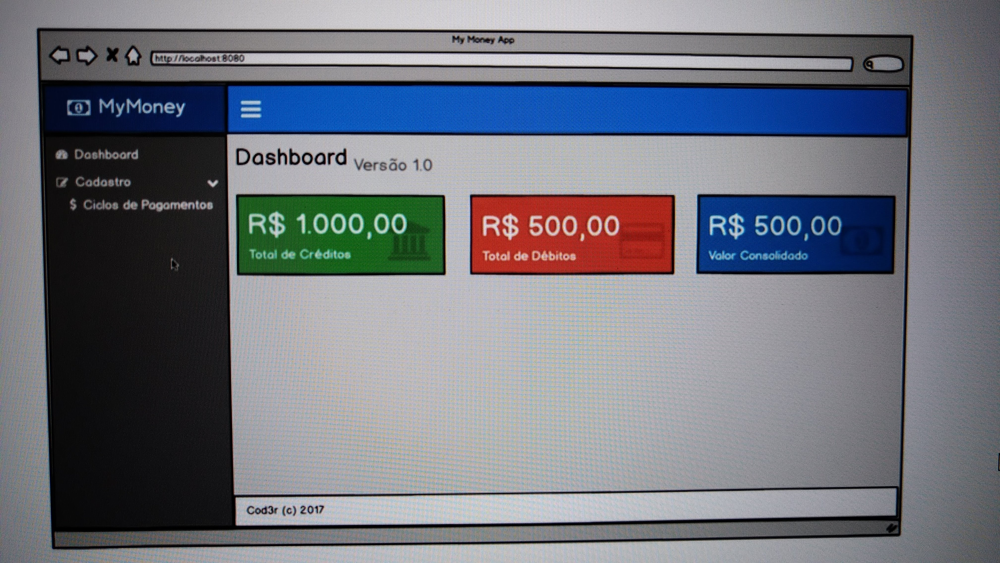

# Aplicação Final - Ciclos de Pagamentos

Aplicação para controle de ciclos de pagamento desenvolvida durante o curso de React + Redux.

---

## Backend - tecnologias utilizadas:

* MongoDB - Banco de dados não relacional
* Mongoose ODM -  fornecer o mapeamento de objetos (Schema) do MongoDB
* Node Restful - Biblioteca para fornecer API REST.
* Express - Servidor web
* Node.js - backend javascript

---

### Dependencias Backend - versão inicial: 

* npm i --save express@4.14.0
* mongoose@4.7.0
* body-parser@1.15.2 - Middlewwares para interpretar corpo da requisição 
* lodash@4.17.4 
* mongoose-paginate@5.0.3
* express-query-int@1.0.1
* node-restful@0.2.5
* pm2@2.1.5
* nodemon@1.11.0 - dependência de desenvolvimento

---

Servidor roda na porta 3003

---

## Frontend- tecnologias utilizadas:

* React
* Redux
* Axios
* Font Awesome
* Template AdminLTE
* Jquery.
* Express - Servidor web

---

### Dependencias Frontend- versão inicial: 

* webpack@1.14.0 
* webpack-dev-server@1.16.2
* babel-core@6.22.1 
* babel-loader@6.2.10 
* babel-plugin-react-html-attrs@2.0.0 
* babel-plugin-transform-object-rest-spread@6.22.0 
* babel-preset-es2015@6.22.0 
* babel-preset-react@6.22.0
* extract-text-webpack-plugin@1.0.1 
* css-loader@0.26.1 
* style-loader@0.13.1 
* file-loader@0.9.0
* admin-lte@2.3.6 
* font-awesome@4.7.0 
* ionicons@3.0.0
* react@15.4.2 
* react-dom@15.4.2 
* react-router@3.0.2 
* redux@3.6.0 
* react-redux@4.4.6 
* redux-form@6.4.1 
* redux-multi@0.1.12 
* redux-promise@0.5.3 
* redux-thunk@2.1.0 
* react-redux-toastr@4.4.2 
* axios@0.15.3 
* lodash@4.17.4 